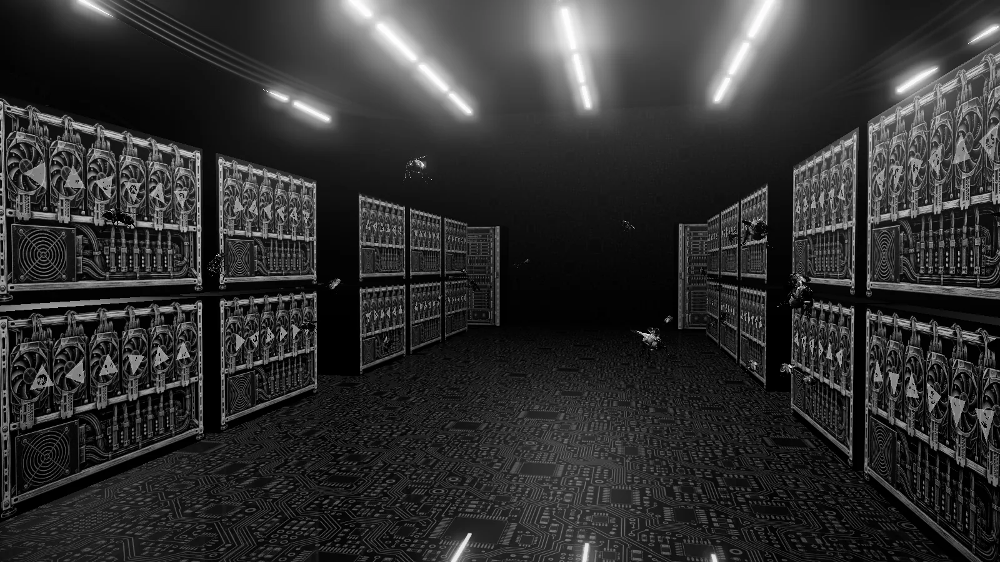
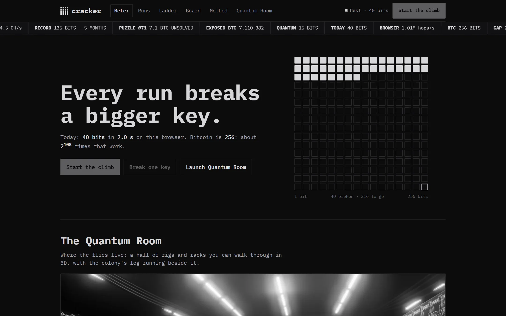
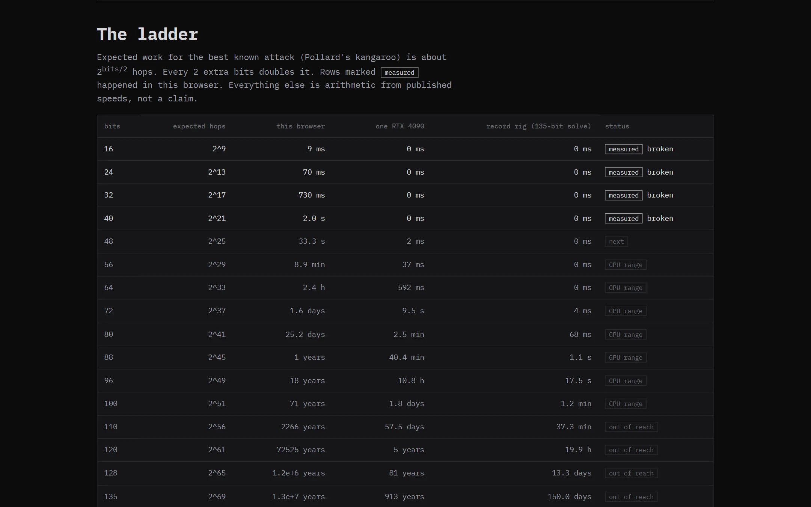
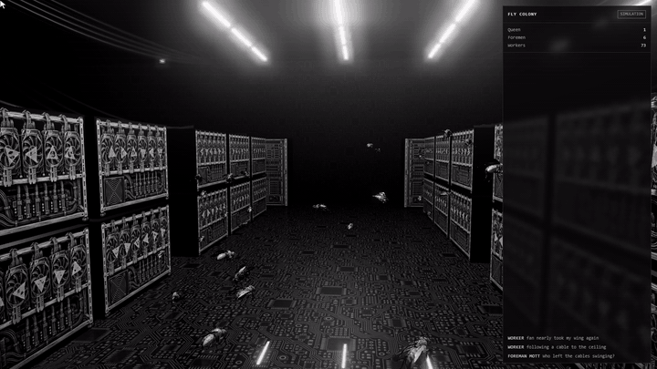
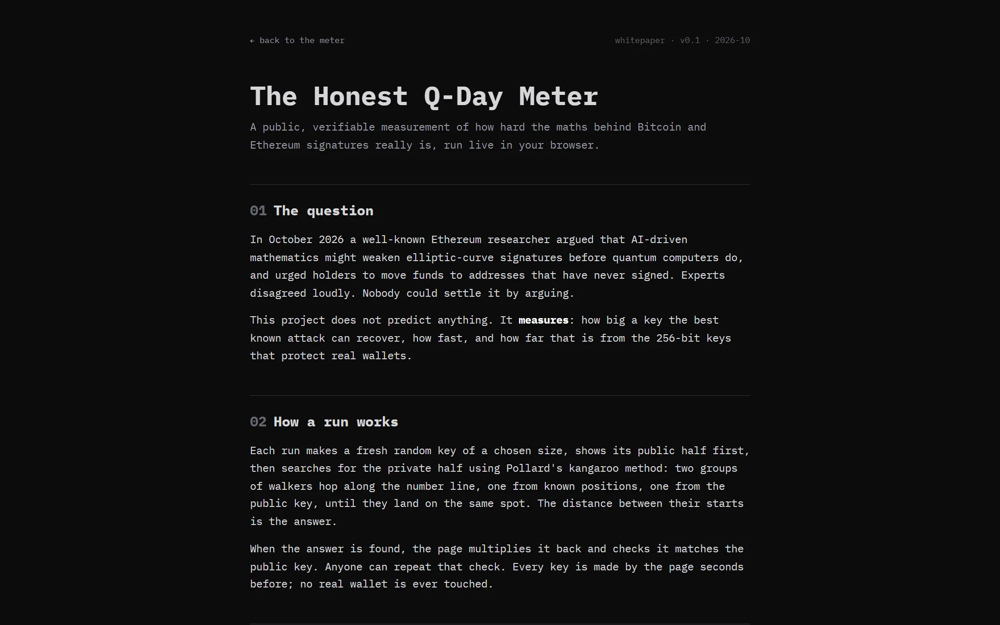

<div align="center">



# QUANTUM BREAK

**Every run breaks a bigger key, live in your browser, with proof.**
<br>Then it shows how far that is from a real 256-bit Bitcoin key.

`secp256k1` · `Pollard's kangaroo` · `16 → 48 bits in a browser tab` · `256 bits to go`

</div>

---



## What it is

A measurement, not a prediction. Each run makes a fresh random key, shows its public half first, searches for the private half in a web worker, then multiplies it back to prove the answer. No real wallet is ever touched.

| | |
|---|---|
| **Measured** | Keys of 16 to 48 bits found live in your browser, each verified |
| **Projected** | The same sizes on one RTX 4090, and the 135-bit record rig |
| **The wall** | Every 2 extra bits doubles the work. 256 bits is about 2¹⁰⁴ times a 48-bit run |



## The Quantum Room

Where the flies live: a black-and-white hall of mining rigs and server racks you can walk through in 3D, with spinning fans, cables, a reflective floor, and the colony's log (labelled simulation) running beside it.



## Whitepaper

The full write-up, including how a run works and what is measured versus projected, is in [`whitepaper.html`](whitepaper.html).



## Research notes

Long-form conceptual notes in [`research.html`](research.html): the colony as a distributed-search metaphor, the scaling and economics of GPU expeditions, post-quantum migration (hash-based signatures, "bunker mode"), and open questions. These are **speculative thought experiments**, not predictions or advice. Every claim is tagged measured, quoted, arithmetic or speculative.

## Run it

Static files, no build step:

```bash
python -m http.server 5437
```

Then open `http://localhost:5437`. The room is at `/room.html`.

---

<div align="center"><sub>Black and white by design. All art is generated, never drawn in code.</sub></div>
